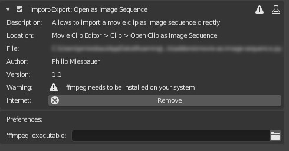

# Movie as Image Sequence

## Overview

This Blender Add-on has been developed for Blender 2.80+.

It allows to import movie clips directly as image sequences. This is useful especially
when working wanting to change the framerate of a movie clip or doing motion tracking.

## Requirements

This Add-on depends on and istalled version [ffmpeg](https://www.ffmpeg.org/).

### Operating System

This Add-on has been tested on **Blender 2.82a** on **Windows 10**, but it has been developed for cross-platform, i.e.
it should work on Unix-style systems, like MacOS or Linux.

## How to Use

Once the Add-on is installed and enabled in Blender the **Clip** menu in the **Movie Clip Editor** will have
an additional element titled **Open Movie as Image Sequence**.

Once this option is selected a file dialog opens. Select the video you would like to open as image sequence.

The movie will then be converted into an image sequence using ffmpeg, the image sequence will be opened and the
correct frame range will be set in the scene.

## Troubleshooting

### Can't locate 'ffmpeg' executable

If the system is not able to locate your installation of ffmpeg, then it is probably not in your `PATH`.

Two solutions are avaiable for solving this problem.

1. Add the folder containing your ffmpeg executable to your `PATH`.

2. Insert the location of the ffmpeg executable manually in the **Preferences** of the Add-on.  
NOTE: Ensure the Add-on is enabled, as you will not be able to see the Preferences tab otherwise.

